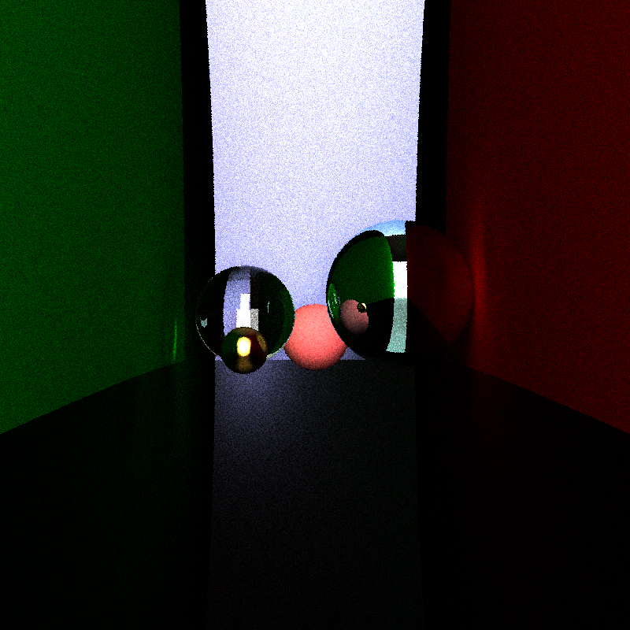
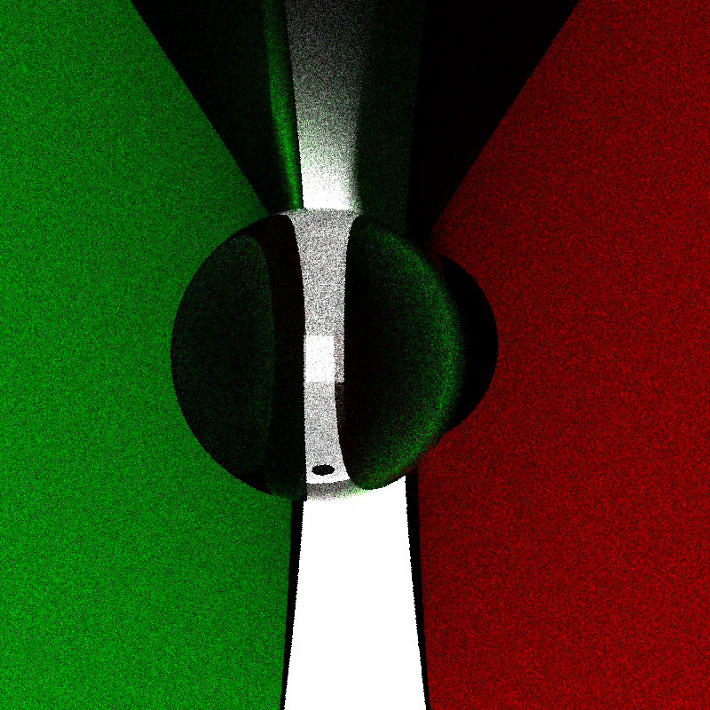
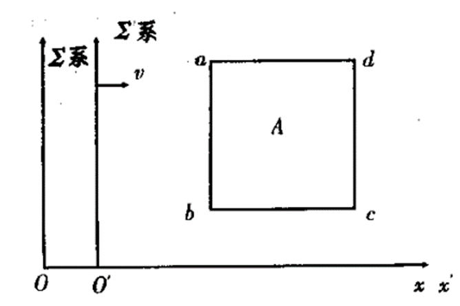
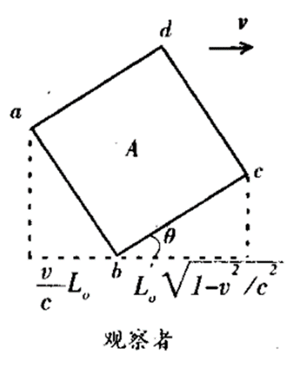
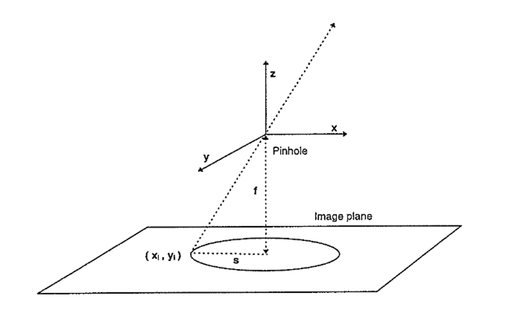

# taichi-relativistic_path_tracing
## 项目目的
相对论效应下的真实场景是什么样的？过去有一些程序动画的模拟结果，都能很好地反映狭义相对论效应下的变形和谱移，但是其虚拟性总是是我不能很直观地感受如果发生在真实世界将会是什么样的效果。于是尝试自己写一个程序实现相对真实地渲染狭义相对论效应下的场景。
## 成果展示

<div>
  
  
</div>
<center>无相对运动</center>


<center>相对运动（未添加多普勒效应）</center>

<div>
  
  
</div>

<center>z轴相对速度 beta = 0.4 时分别产生红移和蓝移 </center>

<div>
  
  
</div>
<center>横向和竖向相对运动时产生明显形变效应</center>

## 程序运行
需要用到的依赖库
```
pip install numpy
pip install taichi
```
taichi-pathtracer中搭建场景

运行程序
```
python3 ./taichi-pathtracer.py
```


## 原理介绍
### 狭义相对论视觉效应
我们知道，狭义相对论的两个前提是光速不变原理和狭义相对性原理，进而推出一系列结论如洛伦兹变换和其特例钟慢效应及尺缩效应。其中尺缩效应 $L = L_0\sqrt{1-v^2/c^2}$ 是空间上的测量效应，又叫观测效应，指的是在一个参考系中同时测量物体两端坐标的差值所满足的变换(Einstein 1905)。而真正的视觉效应（观察效应）并非如此，这是许多人容易混淆的一点。如下图，a点发出的光将比b点发出的光晚一些到达观察者，因此在我们的视觉中不应该是一个垂直运动方向的正方形，而应该旋转过一个角度 $\theta = \arcsin{(v/c)}$。 
这种效应称为Terrell效应。

<div>
  
  
</div>

<center>观测效应和观察效应的区别(Guo 2002)</center>


### 多普勒频移
高速运动的物体在视觉上会产生红移或蓝移。公式我们可以查得：
$$\nu=\frac{1}{T}=\frac{\nu_0\sqrt{1-(v/c)^2}}{1-(v/c)\cos\theta}$$
上述相对论多普勒效应中其实难点在于RGB值和光波长的转换。并非所有的RGB颜色都在光谱上，所以我们不能直接实现转换，只能采用近似方法。我们想到的一种可行方法是，可以在波长和色相之间建立粗略近似关系，通过HSV色彩空间和RGB色彩空间的转换实现模拟大致效果。这样在一条光线与物体相交形成散射时，原先存储亮度信息的 saturation 和 value 值被保留，而色相部分经过多普勒频移变换后再与原先的 S 和 V 值结合形成新的RGB值。

### 相对论光线追踪
通常来说有两种渲染方法，一种是光栅渲染，一种是光线追踪。光栅渲染就是将三维物体的采样点应用投影矩阵投影到成像面上。但阴影和反射面的渲染比较复杂。光线追踪程序的基本原理是从光源发出光子，光子传播并与物体表面或次表面产生作用，然后继续传播，直到击中摄像机的传感器。这种方法比较自然地模拟了真实光线，但缺点是对计算要求高。
为了提高计算效率，假设光子沿着直线传播，并且按照光路可逆原理，光线从屏幕像素逆向寻找光源，大大提高了计算效率，因此这种方法被称作反向路径追踪。
下面是一个简化的反向光线追踪例子，用最简单的小孔成像模型加以说明(Howard 1995)。

<center>小孔成像模型(Howard 1995)</center>
任意一条光线由位于原点的小孔和像平面上一点决定，f为焦距，则由

$$\begin{align} r_0&=(0,0,0)\\r_1&=(x_i,y_i,-f)\end{align}$$

描述一条光线。我们如何将这种光线追踪改为考虑相对论性质呢？很简单，只需要把原本的欧式三维空间换为 Minkowski 空间就可以了。此时，光线将由以下信息表示：

$$\begin{align}r_0&=(0,0,0,ct_0) \\ r_1 &= (x_i,y_i,-f,ct_1) \\ ct_1&=ct_0+\sqrt{x_i^2+y_i^2+f^2} \end{align}$$

这是摄像机参考系的光线。我们需要与场景中的物体求交，因此需要再转换为场景坐标系的光线，此处用到洛伦兹变换矩阵：

$$\begin{align}
r_{0}^{\prime}&=\left(0,0, \gamma \beta t_{0}, \gamma c t_{0}\right) \\
r_{1}^{\prime}&=\left(x_{i}, y_{i},-\gamma f+\gamma \beta c t_{1}, \gamma c t_{1}-\gamma \beta f\right) 
\end{align}$$

此处默认场景整体和摄像机有一个固定的相对速度。

## 参考文献
Einstein, A. (1905). On the electrodynamics of moving bodies. _Annalen der physik_, _17_(10), 891-921.

Guo. (2002). 狭义相对论中的观察与观测. 喀什师范学院学报, _6_, 36–38.

Howard, A., Dance, S., & Kitchen, L. (1995). _Relativistic Ray-Tracing: Simulating the Visual Appearance of Rapidly Moving Objects_.

Erdodu, M., & Zdemir, M. (2015). On Reflections and Rotations in Minkowski 3-Space. _Journal of Geometry and Symmetry in Physics_, _39_, 1–16.